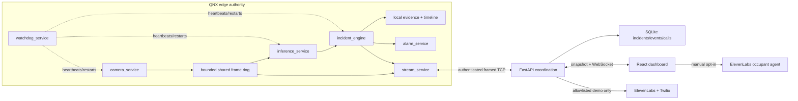

# Architecture

IGNIS keeps authority close to the camera. Network or laptop loss must not prevent local visual verification.

## Authority boundaries

- QNX owns timestamps, inference, persistence, zones, incident creation, evidence, local alarm, and device health.
- FastAPI owns persistence on the laptop, browser broadcast, typed occupant actions, deterministic response timeout, call safety, and provider reconciliation.
- React renders authoritative state and submits requests. It never manufactures incident truth or call connection status.
- The voice agent communicates through typed backend tools only. It cannot change visual evidence or select a destination.

## Failure isolation

Each edge service is a separate executable. Frames use a bounded latest-frame ring; notifications and health use small messages. Streaming has lower priority than inference, and incident/event queues are distinct from replaceable video frames. The watchdog applies restart budgets and exposes degraded/recovered health.

## Modes

- `qnx`: guarded Sensor Framework and TFLite adapters, completed against the target's known-working vendor sample.
- `replay`: the same incident interfaces consume prerecorded/deterministic inputs.
- `simulator`: Python emits production packets to exercise the backend and frontend without edge hardware.

